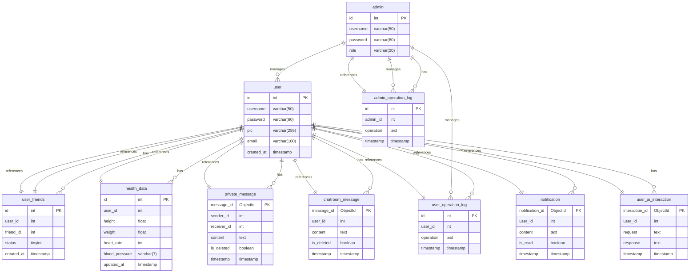

# 基于医疗健康大模型的个人健康知识助手项目设计

## 1 **需求分析**

### 1.1 **项目概述**

本项目是一个基于医疗健康大模型的个人健康知识助手，用户通过平台与大模型进行交互，获取健康建议和医疗知识。平台采用 **Spring Boot + Vue** 的前后端分离架构，使用 **MySQL** 存储用户信息及健康数据，并使用 **MongoDB** 持久化存储聊天记录和通知等非结构化数据。同时，用户可以通过平台记录、管理自己的健康数据，获取个性化健康建议。

为增强用户体验，项目将集成 **社交功能**，允许用户之间添加好友、发送私信，并能够分享自己的健康数据给好友。此外，项目中还使用 **WebSocket** 实现实时消息通知与聊天室功能。

### 1.2 **功能需求**

#### 1.2.1 **用户管理**

- **注册/登录功能**：用户可以通过注册账号并登录，访问系统的健康数据服务。使用账号包括邮箱、用户名和密码等信息。
- **用户个人信息管理**：用户可以管理和更新自己的个人信息，如年龄、性别、联系方式等。
- **管理员管理**：管理员可以管理用户信息、操作日志，并有权限进行敏感数据管理。

#### 1.2.2 **健康数据管理**

- **健康数据记录与查询**：用户可以手动录入健康数据（如体重、心率、血压等），系统会存储并在需要时展示这些数据。
- **个性化健康建议**：通过与大模型交互，用户能够基于自己的健康数据获取个性化的健康建议，系统会记录每次与大模型的交互结果。
- **数据分享与转发**：用户可以选择将自己的健康数据分享给好友或转发给其他用户。

#### 1.2.3 **大模型互动**

- **用户与大模型的交互**：用户可以通过自然语言向大模型提出健康问题，系统将基于大模型的反馈生成个性化的健康建议。(健康知识科普、合理用药提示、医药类考试备考问答、心理健康咨询、医学文献检索、健康膳食指导、运动健康指导等。)
- **大模型调用日志**：系统会记录每次调用大模型API的情况，包括请求时间、用户输入和模型返回的健康建议。

#### 1.2.4 **社交功能**

- **好友系统**：
	- 用户可以搜索其他用户并发送好友申请。
	- 用户可以接受或拒绝好友请求，好友关系一旦建立，用户可以查看好友信息并与好友互动。

- **私信功能**：
	- 用户可以给好友发送私信，支持文字、表情和健康数据的转发。
	- 私信消息支持持久化存储，确保用户可以在上线后查看历史消息。

- **健康数据分享**：
	- 用户可以将自己录入的健康数据分享给好友，帮助好友了解自己的健康状况。
	- 健康数据的分享需要经过用户确认，确保隐私数据不会被误传。

- **聊天室功能**：
	- 用户可以进入群聊，与用户实时沟通，讨论健康相关话题。

#### 1.2.5 **消息通知**

- **实时消息通知**：用户上线后，会收到未读消息和好友请求通知。
- **消息积压处理**：当用户不在线时，系统会存储积压的消息，待用户上线后进行推送。

#### 1.2.6 **管理员功能**

- **用户管理**：管理员可以对平台中的所有用户进行管理，包括查看用户信息、禁用用户账号等。
- **日志查看**：管理员可以查看系统的操作日志，包括用户与大模型的交互记录，确保系统运行稳定。
- **健康数据管理**：管理员有权限对用户的健康数据进行查询和修改，用于特殊情况的处理。

### 1.3 **非功能需求**

- **安全性**：用户数据和健康数据的隐私保护是系统的核心需求之一。系统需要采取多层次的安全措施，如密码加密、数据传输加密等，确保数据的安全。
- **系统性能**：大模型的调用频率较高，系统需要具备良好的性能，支持大并发的API调用和WebSocket连接。
- **扩展性**：系统需要具备良好的扩展性，未来可能需要添加更多社交功能或健康数据分析工具。
- **用户体验**：前端界面友好易用，用户可以轻松查询、管理自己的健康数据，并与大模型进行互动。

### 1.4 **技术选型**

- **后端框架**：Spring Boot，用于快速构建后端REST API。
- **前端框架**：Vue.js，用于构建用户友好的前端界面。
- **数据库**：MySQL 用于存储结构化数据（用户信息、健康数据等）；MongoDB 用于存储聊天记录、通知等非结构化数据。Redis 用于缓存数据。
- **消息队列**：RabbitMQ，用于消息积压和实时消息推送的处理。
- **WebSocket**：用于实现实时聊天和通知功能。
- **大模型接口**：与大模型API（支持OpenAI协议）集成，通过Spring AI框架进行大模型的调用。
---

## 2 系统架构设计

### 2.1 系统模块设计

| 模块名称           | 功能描述                                                                                                                                         |
|--------------------|--------------------------------------------------------------------------------------------------------------------------------------------------|
| **用户管理模块**   | 负责用户的注册、登录、认证、信息管理等。                                                                                                        |
| **健康知识模块**   | 管理健康知识的查询与智能推荐，依赖大模型 API 提供个性化健康知识服务。                                                                            |
| **即时通讯模块**   | 实现用户间的一对一聊天和群聊功能，支持实时通信，使用 WebSocket 进行消息传输。                                                                     |
| **消息通知模块**   | 系统推送健康提醒、社交互动等消息通知，支持在线和离线通知机制。                                                                                  |
| **日志与监控模块** | 记录系统运行日志，监控系统性能，提供实时报警机制。                                                                                              |
| **文件存储模块**   | 支持用户上传文件的存储，开发环境使用 MinIO，生产环境使用阿里云 OSS。                                                                            |

### 2.2 系统架构图


### 2.3 技术选型说明

- **Spring Boot**：作为后端开发框架，简化配置，提高开发效率。
- **MyBatis**：持久层框架，用于 MySQL 数据库的交互。
- **WebSocket**：实现即时通讯，支持全双工通信。
- **Redis**：缓存用户数据和系统状态，提高数据访问速度。
- **阿里云 OSS**：用于生产环境下的文件存储，提供高可靠性和扩展性。
- **MinIO**：开发环境下使用的轻量化文件存储方案。

---

## 3 数据库设计

### 3.1 数据库设计概览

- **MySQL**：用于存储结构化数据，如用户信息、好友关系、健康数据、操作日志等。
- **MongoDB**：用于存储高并发消息数据（私信、聊天室、通知）以及用户与大模型的交互记录。
- **Redis**：用于缓存健康数据、消息通知以及用户登录状态，加速系统的访问速度。


---

### 3.2 **用户表 (`user`)**

| 字段名          | 数据类型         | 约束               | 备注   |
| ------------ | ------------ | ---------------- | ---- |
| `id`         | INT          | PRIMARY KEY      | 用户ID |
| `username`   | VARCHAR(50)  | UNIQUE, NOT NULL | 用户名  |
| `password`   | VARCHAR(60)  | NOT NULL         | 密码   |
| `pic`        | VARCHAR(255) |                  | 头像   |
| `email`      | VARCHAR(100) | UNIQUE, NOT NULL | 邮箱   |
| `created_at` | TIMESTAMP    | NOT NULL         | 注册时间 |

```sql
-- 创建用户表
CREATE TABLE user (
    id INT PRIMARY KEY AUTO_INCREMENT COMMENT '用户ID',
    username VARCHAR(50) UNIQUE NOT NULL COMMENT '用户名',
    password VARCHAR(60) NOT NULL COMMENT '密码', -- 通常密码哈希长度为60
    pic VARCHAR(255) COMMENT '头像',
    email VARCHAR(100) UNIQUE NOT NULL COMMENT '邮箱',
    created_at TIMESTAMP DEFAULT CURRENT_TIMESTAMP COMMENT '注册时间'
) COMMENT '用户表';
```

### 3.3 **用户好友表 (`user_friends`)**

| 字段名      | 数据类型     | 约束         | 备注             |
|-------------|--------------|--------------|------------------|
| `id`        | INT          | PRIMARY KEY  | 记录ID           |
| `user_id`   | INT          | NOT NULL     | 用户ID           |
| `friend_id` | INT          | NOT NULL     | 好友的用户ID     |
| `status`    | TINYINT      | NOT NULL     | 好友状态（1=已添加，0=请求中，-1=已拒绝） |
| `created_at`| TIMESTAMP    | NOT NULL     | 添加好友的时间   |

```sql
-- 创建用户好友表
CREATE TABLE user_friends (
    id INT PRIMARY KEY AUTO_INCREMENT COMMENT '记录ID',
    user_id INT NOT NULL COMMENT '用户ID',
    friend_id INT NOT NULL COMMENT '好友的用户ID',
    status TINYINT NOT NULL DEFAULT 1 COMMENT '好友状态（1=已添加，0=请求中，-1=已拒绝）',
    created_at TIMESTAMP DEFAULT CURRENT_TIMESTAMP COMMENT '添加好友的时间',
    FOREIGN KEY (user_id) REFERENCES user(id),
    FOREIGN KEY (friend_id) REFERENCES user(id)
) COMMENT '用户好友表';
```

### 3.4 **健康数据表 (`health_data`)**

| 字段名              | 数据类型       | 约束          | 备注   |
| ---------------- | ---------- | ----------- | ---- |
| `id`             | INT        | PRIMARY KEY | 数据ID |
| `user_id`        | INT        | NOT NULL    | 用户ID |
| `height`         | FLOAT      | NOT NULL    | 身高   |
| `weight`         | FLOAT      | NOT NULL    | 体重   |
| `heart_rate`     | INT        | NOT NULL    | 心率   |
| `blood_pressure` | VARCHAR(7) | NOT NULL    | 血压   |
| `updated_at`     | TIMESTAMP  | NOT NULL    | 更新日期 |

```sql
-- 创建健康数据表
CREATE TABLE health_data (
    id INT PRIMARY KEY AUTO_INCREMENT COMMENT '数据ID',
    user_id INT NOT NULL COMMENT '用户ID',
    height FLOAT NOT NULL COMMENT '身高',
    weight FLOAT NOT NULL COMMENT '体重',
    heart_rate INT NOT NULL COMMENT '心率',
    blood_pressure VARCHAR(7) NOT NULL COMMENT '血压', -- 格式如 '120/80'
    updated_at TIMESTAMP DEFAULT CURRENT_TIMESTAMP ON UPDATE CURRENT_TIMESTAMP COMMENT '更新日期',
    FOREIGN KEY (user_id) REFERENCES user(id)
) COMMENT '健康数据表';
```

### 3.5 **管理员表 (`admin`)**

| 字段名        | 数据类型        | 约束               | 备注     |
| ---------- | ----------- | ---------------- | ------ |
| `id`       | INT         | PRIMARY KEY      | 管理员ID  |
| `username` | VARCHAR(50) | UNIQUE, NOT NULL | 管理员用户名 |
| `password` | VARCHAR(60) | NOT NULL         | 管理员密码  |
| `role`     | VARCHAR(20) | NOT NULL         | 管理员角色  |

```sql
-- 创建管理员表
CREATE TABLE admin (
    id INT PRIMARY KEY AUTO_INCREMENT COMMENT '管理员ID',
    username VARCHAR(50) UNIQUE NOT NULL COMMENT '管理员用户名',
    password VARCHAR(60) NOT NULL COMMENT '管理员密码', -- 通常密码哈希长度为60
    role VARCHAR(20) NOT NULL COMMENT '管理员角色'
) COMMENT '管理员表';
```

### 3.6 **管理员操作日志表 (`admin_operation_log`)**

| 字段名        | 数据类型     | 约束         | 备注             |
|---------------|--------------|--------------|------------------|
| `id`          | INT          | PRIMARY KEY  | 日志ID           |
| `admin_id`    | INT          | NOT NULL     | 管理员ID         |
| `operation`   | TEXT         | NOT NULL     | 操作内容         |
| `timestamp`   | TIMESTAMP    | NOT NULL     | 操作时间         |

```sql
-- 创建管理员操作日志表
CREATE TABLE admin_operation_log (
    id INT PRIMARY KEY AUTO_INCREMENT COMMENT '日志ID',
    admin_id INT NOT NULL COMMENT '管理员ID',
    operation TEXT NOT NULL COMMENT '操作内容',
    timestamp TIMESTAMP DEFAULT CURRENT_TIMESTAMP COMMENT '操作时间',
    FOREIGN KEY (admin_id) REFERENCES admin(id)
) COMMENT '管理员操作日志表';
```

### 3.7 **用户操作日志表 (`user_operation_log`)**

| 字段名        | 数据类型     | 约束         | 备注             |
|---------------|--------------|--------------|------------------|
| `id`          | INT          | PRIMARY KEY  | 日志ID           |
| `user_id`     | INT          | NOT NULL     | 用户ID           |
| `operation`   | TEXT         | NOT NULL     | 操作内容         |
| `timestamp`   | TIMESTAMP    | NOT NULL     | 操作时间         |

```sql
-- 创建用户操作日志表
CREATE TABLE user_operation_log (
    id INT PRIMARY KEY AUTO_INCREMENT COMMENT '日志ID',
    user_id INT NOT NULL COMMENT '用户ID',
    operation TEXT NOT NULL COMMENT '操作内容',
    timestamp TIMESTAMP DEFAULT CURRENT_TIMESTAMP COMMENT '操作时间',
    FOREIGN KEY (user_id) REFERENCES user(id)
) COMMENT '用户操作日志表';
```

---

### 3.8 **MongoDB 消息存储**

#### 3.8.1 **私信 (`private_message`)**

| 字段名           | 数据类型     | 约束        | 备注        |
|------------------|--------------|-------------|-------------|
| `message_id`     | ObjectId     | PRIMARY KEY | 消息ID      |
| `sender_id`      | INT          | NOT NULL    | 发送者ID    |
| `receiver_id`    | INT          | NOT NULL    | 接收者ID    |
| `content`        | TEXT         | NOT NULL    | 消息内容    |
| `is_deleted`     | BOOLEAN      | 默认false   | 是否逻辑删除 |
| `timestamp`      | TIMESTAMP    | NOT NULL    | 发送时间    |

```json
{
    "message_id": ObjectId(),
    "sender_id": 1,
    "receiver_id": 2,
    "content": "消息内容",
    "is_deleted": false,
    "timestamp": ISODate()
}
```

#### 3.8.2 **聊天室消息 (`chatroom_message`)**

| 字段名           | 数据类型     | 约束        | 备注        |
|------------------|--------------|-------------|-------------|
| `message_id`     | ObjectId     | PRIMARY KEY | 消息ID      |
| `user_id`        | INT          | NOT NULL    | 用户ID      |
| `content`        | TEXT         | NOT NULL    | 消息内容    |
| `is_deleted`     | BOOLEAN      | 默认false   | 是否逻辑删除 |
| `timestamp`      | TIMESTAMP    | NOT NULL    | 发送时间    |

```json
{
    "message_id": ObjectId(),
    "user_id": 1,
    "content": "聊天室消息内容",
    "is_deleted": false,
    "timestamp": ISODate()
}
```

#### 3.8.3 **通知消息 (`notification`)**

| 字段名           | 数据类型     | 约束        | 备注        |
|------------------|--------------|-------------|-------------|
| `notification_id`| ObjectId     | PRIMARY KEY | 通知ID      |
| `user_id`        | INT          | NOT NULL    | 用户ID      |
| `content`        | TEXT         | NOT NULL    | 通知内容    |
| `is_read`        | BOOLEAN      | 默认false   | 是否已读    |
| `timestamp`      | TIMESTAMP    | NOT NULL    | 发送时间    |

```json
{
    "notification_id": ObjectId(),
    "user_id": 1,
    "content": "通知内容",
    "is_read": false,
    "timestamp": ISODate()
}
```

#### 3.8.4 **用户与大模型的交互记录 (`user_ai_interaction`)**

| 字段名           | 数据类型     | 约束        | 备注        |
|------------------|--------------|-------------|-------------|
| `interaction_id` | ObjectId     | PRIMARY KEY | 记录ID      |
| `user_id`        | INT          | NOT NULL    | 用户ID      |
| `request`        | TEXT         | NOT NULL    | 用户请求    |
| `response`       | TEXT         | NOT NULL    | 大模型回复  |
| `timestamp`      | TIMESTAMP    | NOT NULL    | 交互时间    |

```json
{
    "interaction_id": ObjectId(),
    "user_id": 

1,
    "request": "用户输入内容",
    "response": "大模型回复内容",
    "timestamp": ISODate()
}
```

---

### 3.9 **Redis 缓存操作**

- **健康数据缓存**：每次用户更新健康数据时，系统会将最新的数据缓存到Redis中。缓存结构为哈希表，键为`health_data:<user_id>`，值为用户的健康数据。

```bash
HMSET health_data:1 height 175 weight 70 heart_rate 80 blood_pressure "120/80"
```

- **通知消息缓存**：在发送通知时，缓存未读通知的数量，使用`notification:<user_id>:unread`。

```bash
SET notification:1:unread 5
```

- **用户登录状态缓存**：用于存储用户登录状态，键为`user_session:<user_id>`，值为用户会话信息。

```bash
SET user_session:1 "session_data"
```

---

## 4 API

### 4.1 用户 API

#### 4.1.1 用户注册接口

- **URL:** `/api/user/register`
- **请求方式:** POST
- **请求参数:**  

  | 参数名      | 类型     | 是否必填 | 描述     |
  |------------|----------|----------|----------|
  | username   | string   | 是       | 用户名    |
  | password   | string   | 是       | 密码      |
  | email      | string   | 是       | 邮箱      |

- **返回示例:**

```json
{
  "message": "注册成功",
  "userId": 1
}
```

#### 4.1.2 用户登录接口

- **URL:** `/api/user/login`
- **请求方式:** POST
- **请求参数:**  

  | 参数名      | 类型     | 是否必填 | 描述     |
  |------------|----------|----------|----------|
  | username   | string   | 是       | 用户名    |
  | password   | string   | 是       | 密码      |

- **返回示例:**

```json
{
  "message": "登录成功",
  "token": "jwt_token"
}
```

#### 4.1.3 用户上传头像接口

- **URL:** `/api/user/upload-pic`
- **请求方式:** POST
- **请求参数:**  

  | 参数名   | 类型   | 是否必填 | 描述           |
  |---------|--------|----------|----------------|
  | userId  | int    | 是       | 用户 ID         |
  | pic     | file   | 是       | 头像图片文件   |

- **返回示例:**

```json
{
  "message": "头像上传成功"
}
```

#### 4.1.4 获取用户信息接口

- **URL:** `/api/user/info`
- **请求方式:** GET
- **请求参数:**  

  | 参数名      | 类型     | 是否必填 | 描述     |
  |------------|----------|----------|----------|
  | userId     | int      | 是       | 用户 ID    |

- **返回示例:**

```json
{
  "userId": 1,
  "username": "testuser",
  "email": "user@example.com",
  "pic": "http://example.com/images/pic.jpg",
  "created_at": "2024-10-10"
}
```

### 4.2 好友 API

#### 4.2.1 添加好友接口

- **URL:** `/api/friends/add`
- **请求方式:** POST
- **请求参数:**  

  | 参数名      | 类型     | 是否必填 | 描述     |
  |------------|----------|----------|----------|
  | userId     | int      | 是       | 用户 ID    |
  | friendId   | int      | 是       | 好友 ID    |

- **返回示例:**

```json
{
  "message": "好友添加成功"
}
```

#### 4.2.2 获取好友列表接口

- **URL:** `/api/friends/list`
- **请求方式:** GET
- **请求参数:**  

  | 参数名      | 类型     | 是否必填 | 描述     |
  |------------|----------|----------|----------|
  | userId     | int      | 是       | 用户 ID    |

- **返回示例:**

```json
{
  "friends": [
    {
      "friendId": 2,
      "friendName": "friend1"
    },
    {
      "friendId": 3,
      "friendName": "friend2"
    }
  ]
}
```

### 4.3 健康数据 API

#### 4.3.1 获取健康数据接口

- **URL:** `/api/health/get`
- **请求方式:** GET
- **请求参数:**  

  | 参数名      | 类型     | 是否必填 | 描述     |
  |------------|----------|----------|----------|
  | userId     | int      | 是       | 用户 ID    |

- **返回示例:**

```json
{
  "userId": 1,
  "healthData": {
    "weight": 70,
    "height": 175,
    "bloodPressure": "120/80",
    "heartRate": 70
  }
}
```

#### 4.3.2 更新健康数据接口

- **URL:** `/api/health/update`
- **请求方式:** POST
- **请求参数:**  

  | 参数名           | 类型    | 是否必填 | 描述               |
  |-----------------|---------|----------|--------------------|
  | userId          | int     | 是       | 用户 ID              |
  | weight          | float   | 否       | 体重                |
  | height          | float   | 否       | 身高                |
  | bloodPressure   | string  | 否       | 血压                |
  | heartRate       | int     | 否       | 心率                |

- **返回示例:**

```json
{
  "message": "健康数据更新成功"
}
```

### 4.4 聊天室 API

#### 4.4.1 发送聊天室消息接口

- **URL:** `/api/chatroom/send`
- **请求方式:** POST
- **请求参数:**  

  | 参数名      | 类型     | 是否必填 | 描述     |
  |------------|----------|----------|----------|
  | userId     | int      | 是       | 用户 ID    |
  | message    | string   | 是       | 消息内容  |

- **返回示例:**

```json
{
  "message": "消息发送成功"
}
```

#### 4.4.2 获取聊天室历史消息接口

- **URL:** `/api/chatroom/history`
- **请求方式:** GET
- **请求参数:**  

  | 参数名      | 类型     | 是否必填 | 描述     |
  |------------|----------|----------|----------|
  | userId     | int      | 是       | 用户 ID    |

- **返回示例:**

```json
{
  "messages": [
    {
      "userId": 1,
      "message": "你好！",
      "timestamp": "2024-10-10 10:00:00"
    },
    {
      "userId": 2,
      "message": "你好，欢迎加入！",
      "timestamp": "2024-10-10 10:01:00"
    }
  ]
}
```

### 4.5 用户与大模型 API

#### 4.5.1 调用大模型接口

- **URL:** `/api/ai/call`
- **请求方式:** POST
- **请求参数:**  

  | 参数名      | 类型     | 是否必填 | 描述     |
  |------------|----------|----------|----------|
  | userId     | int      | 是       | 用户 ID    |
  | query      | string   | 是       | 查询内容  |

- **返回示例:**

```json
{
  "message": "调用成功",
  "response": "这是大模型的回答"
}
```

#### 4.5.2 获取用户历史大模型对话记录接口

- **URL:** `/api/ai/history`
- **请求方式:** GET
- **请求参数:**  

  | 参数名      | 类型     | 是否必填 | 描述     |
  |------------|----------|----------|----------|
  | userId     | int      | 是       | 用户 ID    |

- **返回示例:**

```json
{
  "history": [
    {
      "query": "你好，大模型",
      "response": "你好，有什么我可以帮忙的吗？",
      "timestamp": "2024-10-10 10:00:00"
    },
    {
      "query": "帮我推荐健康的生活方式",
      "response": "好的，我建议每天多运动，保持均衡饮食。",
      "timestamp": "2024-10-10 10:01:00"
    }
  ]
}
```
